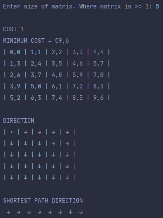
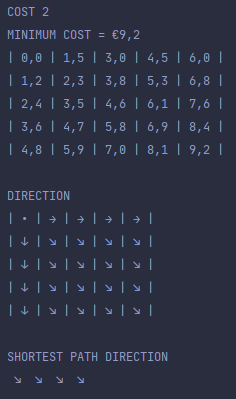

# CutPaperRoll-MovingRobot
## Bottom-up dynamic approach to solve cutting roll problem where Roll length is:
| LENGTH | COST  | 
| -----  |:-----| 
| 1      | €1.2  | 
| 2      | €3    | 
| 3      | €5.8  | 
| 5      | €10.1 | 

&nbsp;

## Bottom-up dynamic approach to move an entity untill it reaches the finish line most efficiently when there are different costs associated with each move made

| MOVEMENT  | COST1 | COST2 |
| --------- |:-----:| :----:|
| RIGHT     | 1.1   | 1.5   |
| DOWN      | 1.3   | 1.2   |
| DIAGONAL  | 2.5   | 2.3   |

&nbsp;

